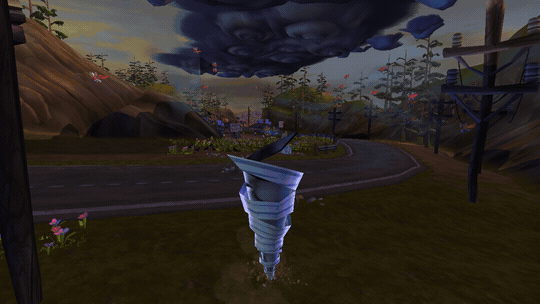
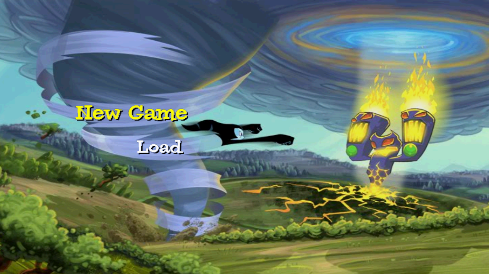
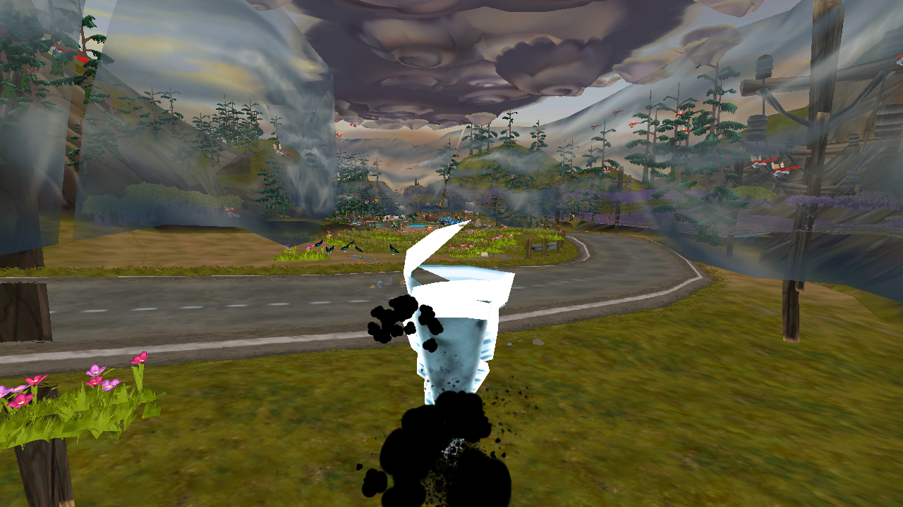
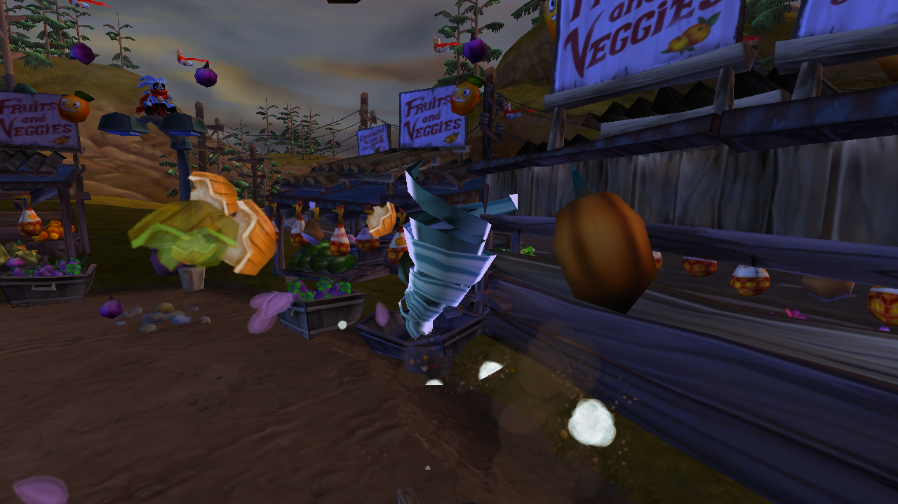
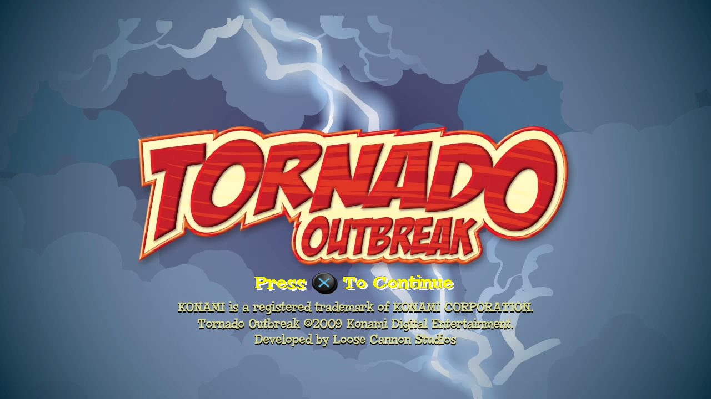

# Progress log

Newest first. Fixes are in [ps3recomp](https://github.com/sp00nznet/ps3recomp)
unless noted.

## 2026-09-27: rendering correct, no overrides

The black text, black speech bubbles, black smoke and leaves, the cyan
"trapezoid", the black main menu and the flickering display all came from
runtime bugs; nothing title-specific. Fixes are in ps3recomp:

| Symptom | Cause |
|---|---|
| UI, particles and bubbles rendered black; the lit VS output 0 | **Vertex-program flow control was dropped.** BRI/CAL/RET carry no write mask, so the decompiler skipped them and every block ran: a shader branching around its lighting when lighting is off zeroed its colour and summed no lights. ~40 of this game's VPs branch. Now emitted as a block state machine |
| Colour NaN in lit shaders | NV vertex programs multiply by the legacy rule (0 × anything = 0, INF/NaN included); IEEE made one RCP of zero poison the sum, and the FP's NaN guard turned it black. MUL/MAD/DP3/DP4/DPH now use it |
| Predicated writes ran unconditionally, CC-only writes lost | VP condition codes were unmodelled |
| Main menu presented black on two frames in three | The scaled NV3089 resolve was presented as a live alias of its source; it is now a real GPU copy into the display buffer at resolve time, sourced from the surface with the closest base (a stale surface at 0x0 "contained" the address first) |
| Boot hang, ~1 run in 5, before GCM init | A raw SPU's outbound mailbox is one deep and `wrch` stalls when full; buffering let two replies queue and the PPU, testing bit 0 of the count, read 2 as empty |
| Shader constants overwritten by FIFO words | `rsx_dispatch_method` indexed `regs[]` with methods up to 0xFFFFC; now bounds-checked |

`tools/vp_eval.py` in ps3recomp evaluates a decompiled VP on the CPU with the
constants and vertices a traced draw used — how the NaN and the dropped
branches were found.

## 2026-09-26: in game

Main menu → New Game → story intro → first level (`jb_intro.bgw.sdat`), the
tornado driven by the left stick at ~16 fps.

|  |  |  |
|---|---|---|

| Symptom | Cause |
|---|---|
| Menu text invisible | Two bugs, both still open: the glyphs fail the depth test, and the lighting VS computes black. `LD_NO_DEPTH=1` + `LD_FORCE_COL0=<pso>` make it readable. VP condition codes were also unmodeled (fixed) |
| New Game: "Unable to save game data" | `cellSaveDataListSave2` read the chosen directory from a host struct nothing filled; the title's `newData` in the guest `ListSet` was never read |
| Wedged right after the save | Wwise's audio SPURS jobs were unlifted: they completed empty and the sound engine waited forever. Six job binaries now captured (`SPU_DUMP_MISS`) and lifted, 0 MISSes |
| 2 GB log in three minutes | The dispatch-MISS line was uncapped at 1500 jobs/s |

## 2026-09-26: day one — title screen renders and takes input

Lift and build went through first time with nothing title-specific: 17,138
functions, 103 imports across 10 libraries, one 5 KB SPU image.

What stood between the first boot and the title screen, in order:

| Symptom | Cause |
|---|---|
| Main thread spun forever on `0xE0043014` | Raw SPU MFC proxy DMA (the PPU writes LSA/EA/size/cmd into the problem-state window) was not implemented; the guest read its own command back as `MFC_CMDStatus` |
| Raw SPU never started | The game streams its SPU program in by proxy GET instead of `sys_spu_image_import`, so no image was resolved. Ports now also register each image's text-segment fingerprint and the runtime matches the GET'd range |
| Hung at frame 19, `0xDEADBEEF` fence never answered | `func_000D60E0` (SPU memcpy) takes the PPU path when the destination shares the **stack's** top nibble. The runtime's main stack was at `0x0FF00000`, so every low address looked like the stack and the SPU was never asked. `PS3_MAIN_STACK_LV2=1` puts it at `0xD0000000` like lv2 |
| Same hang, ~40% of runs | `spu_channel` `count++`/`count--` from PPU and SPU threads with no lock lost a mailbox word |
| Hang in the GCM wrap callback | The runtime "recycled" the title's command ring while its own callback (64 KB segments) was about to — rewinding put/get under it |
| Title drew 58 draws a frame to black | NV3089 blits ignored the clip rectangle: the 2:1 resolve's bottom 512-row band overran the display buffer into the staging area of the full-screen quad's vertices, so the quad drew with zero positions. Format 7 is also R5G6B5 (2 bytes), not 32-bit |
| Frames presented a stale surface | The scene is rendered 2x2 supersampled and resolved by scaled NV3089 blits; the flip now presents the resolve's source surface |
| START did nothing | Injected pad presses were zeroed in pressure mode; the title reads the pressure words |

## Open

After START the menu text (PSO `ae0d773cfb90afbf`, a lighting uber-shader with
condition codes) renders nothing. VP condition-code support was added to the
decompiler; the text still comes out invisible. Next: compute the VS colour
output for one glyph against the constants, and check the full-screen
background draw (`d331ec6c11abf4e9`, drawn first).

Wwise's two SPURS jobs (`0x52A580`, 1168 B; `0x52D900`, 272 B) MISS dispatch —
raw job blobs, not ELFs; audio is silent until they are lifted.
